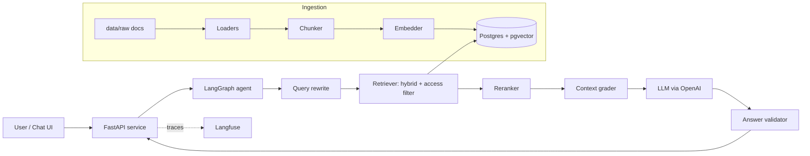

# Enterprise Knowledge Assistant: Project Plan

> A learning project: build an internal-staff knowledge assistant (RAG + agentic workflow) from scratch, running entirely locally on free tools.

**Status:** Planning
**Target duration:** ~4 weeks (part-time)
**Last updated:** (fill in on each commit)

---

## 1. Project Overview

### 1.1 What is this?
An AI assistant for internal employees of a fictional company ("Acme Bank"). Staff ask questions in natural language (HR policy, leave rules, IT helpdesk, expenses, compliance) and get **accurate, cited answers grounded only in company documents**.

### 1.2 Why am I building it?
- Learn the full lifecycle of an enterprise RAG system: ingestion, chunking, embeddings, retrieval, generation, evaluation, observability.
- Learn agentic workflows with LangGraph.
- Reproduce, on free/local tools, the architecture I describe in my resume (Swedbank Enterprise Knowledge Assistant), so I can explain every design decision confidently.

### 1.3 Goals
- [ ] Answer questions from mixed-format documents (PDF, DOCX, XLSX, CSV) with source + page citations.
- [ ] Refuse to answer when the documents do not contain the answer (no hallucination).
- [ ] Enforce role/department-based access control at retrieval time.
- [ ] Support multi-turn conversations (follow-up questions).
- [ ] Include an agentic workflow (classify, rewrite, retrieve, grade, generate, validate).
- [ ] Measure quality with a repeatable evaluation set and record results.
- [ ] Run everything with one command: `docker compose up`.

### 1.4 Non-goals
- No real or confidential company data.
- No production-grade security, scaling, or multi-tenant support.
- No cloud spend during the core build (AWS is an optional Phase 9).

---

## 2. Scope

### 2.1 Users (fake, for testing)
| User | Department | Access level |
|---|---|---|
| alice | HR | manager |
| bob | IT | staff |
| carol | Finance | staff |
| dave | Compliance | admin |
| eve | Any | contractor |

### 2.2 Example use cases
1. "How many casual leave days do I get per year?"
2. "What about contractors?" (follow-up, needs query rewriting)
3. "How do I reset my VPN password?"
4. "Summarize the expense policy and draft an email to my team." (agentic workflow)
5. "What is the CEO's salary?" (must be refused or blocked by access control)
6. A question with no answer in the documents (must say "I couldn't find this").

---

## 3. Architecture



### 3.1 Tech stack (free/local) and AWS equivalents
| Layer | Local choice | AWS equivalent |
|---|---|---|
| LLM | OpenAI (gpt-4.1-mini); fallback: Gemini/Groq free tier | AWS Bedrock Nova Pro |
| Embeddings | `text-embedding-large` (OpenAI) | Bedrock/Titan embeddings |
| Vector + relational store | Postgres 16 + pgvector (Docker) | PostgreSQL pgvector |
| Alternative vector store (later) | Qdrant / OpenSearch (Docker) | AWS OpenSearch |
| Object storage | Local `data/` folder (or MinIO) | S3 |
| API | FastAPI + uvicorn | Lambda + API Gateway |
| Orchestration | LangChain + LangGraph | same |
| Observability | Python logging + Langfuse (self-hosted) | CloudWatch |
| UI | Streamlit or Gradio | n/a |
| Packaging | Docker Compose | n/a |
| Evaluation | Custom scripts + `ragas` / LLM-as-judge | n/a |

### 3.2 Repository structure
```
knowledge-assistant/
├── PLAN.md
├── README.md
├── data/
│   ├── raw/                 # source documents (synthetic)
│   └── eval/                # test questions + expected answers
├── app/
│   ├── core/                # config, logging, auth
│   ├── ingestion/           # loaders, chunking, embedding, indexing
│   ├── retrieval/           # vector, keyword, hybrid, reranker, access filter
│   ├── llm/                 # model client, prompt files, prompt versions
│   ├── agents/              # LangGraph graph + nodes + tools
│   └── api/                 # FastAPI routes, schemas
├── ui/                      # Streamlit / Gradio app
├── eval/                    # eval runner, metrics, result logs
├── tests/
├── docs/
│   ├── decisions.md         # design decision log (ADR-style)
│   └── learning-log.md      # what I learned each week
├── docker-compose.yml
├── pyproject.toml
└── .env.example
```

---

## 4. Phases

Each phase has **tasks**, a **deliverable**, and an **exit criterion** (how I know it's done). Tick boxes as I go.

### Phase 0: Environment setup (Week 1, Days 1-2)
**Tasks**
- [ ] Create Git repo, commit this `PLAN.md`, add `.gitignore` (venv, `.env`, `data/raw` if large, `__pycache__`).
- [ ] Python 3.11+ virtual environment; `pyproject.toml` with dependencies.
- [ ] Install Docker Desktop.
- [ ] Add `docker-compose.yml` with `pgvector/pgvector:pg16`.
- [ ] Create schema (see Section 5).

**Deliverable:** `docker compose up -d` starts Postgres; Ollama answers a test prompt from Python.
**Exit criterion:** A script embeds a sentence and stores/retrieves it from pgvector.

### Phase 1: Data and evaluation set (Week 1, Days 2-3)
**Tasks**
- [ ] Define fictional company "Acme Bank".
- [ ] Create 20-50 documents: HR policy, leave policy, IT helpdesk, expense policy, code of conduct, compliance FAQ, org chart (XLSX), holiday calendar (CSV), etc.
- [ ] Mix formats: PDF, DOCX, XLSX, CSV.
- [ ] Tag each document with `department` and `access_level` (public / staff / manager / admin).
- [ ] Write **30-50 evaluation questions** with expected answer + source document. Include:
  - straightforward lookups
  - multi-chunk questions
  - follow-up questions
  - unanswerable questions (expected: refusal)
  - access-restricted questions

**Deliverable:** `data/raw/` and `data/eval/questions.jsonl`.
**Exit criterion:** Every eval question has a reference answer and source.

### Phase 2: Ingestion pipeline (Week 1, Days 3-5)
**Tasks**
- [ ] Loaders: PDF (`pypdf` / `unstructured`), DOCX (`python-docx`), XLSX/CSV (`pandas`).
- [ ] Preserve metadata: filename, title, page, department, access level.
- [ ] Chunking v1: recursive splitter, ~500-800 tokens, 10-15% overlap.
- [ ] Embed chunks and insert into `chunks` table.
- [ ] Idempotency: hash file contents; skip unchanged files, replace changed ones.
- [ ] CLI command: `python -m app.ingestion.run --path data/raw`.

**Deliverable:** All documents indexed in Postgres.
**Exit criterion:** Re-running ingestion creates no duplicates; row counts match expectation.

### Phase 3: Retrieval (Week 1-2)
**Tasks**
- [ ] Baseline: top-k cosine similarity search.
- [ ] Keyword search using Postgres full-text (`tsvector` + GIN index).
- [ ] Hybrid search using Reciprocal Rank Fusion (RRF).
- [ ] Optional: cross-encoder reranker (`bge-reranker-base`) on the top 20.
- [ ] Measure retrieval hit rate on the eval set for each variant.

**Deliverable:** `retrieval/` module with a common interface (`retrieve(query, user) -> chunks`).
**Exit criterion:** Hit rate@5 recorded for vector vs hybrid vs hybrid+rerank.

### Phase 4: Grounded generation (Week 2)
**Tasks**
- [ ] LLM client wrapper (`llm/client.py`) with a provider interface (Ollama now, Bedrock later).
- [ ] Prompt stored as a versioned file (`llm/prompts/answer_v1.txt`).
- [ ] Prompt rules: answer only from context; cite source and page; say "I couldn't find this in the documents" if unsupported.
- [ ] Format citations in the response.
- [ ] Test on unanswerable questions and record hallucination cases.

**Deliverable:** End-to-end `answer(question) -> answer + citations`.
**Exit criterion:** Unanswerable eval questions are refused at least 80% of the time.

### Phase 5: API and UI (Week 2)
**Tasks**
- [ ] FastAPI endpoints:
  - `POST /chat`: `{question, session_id}` returns `{answer, citations, trace_id}`
  - `POST /ingest`: admin only
  - `GET /health`
- [ ] Pydantic request/response schemas; error handling.
- [ ] Streamlit/Gradio chat UI with citations displayed and a user picker (fake login).

**Deliverable:** Working chat in the browser.
**Exit criterion:** I can chat with the assistant end to end from the UI.

### Phase 6: Memory, rewriting, access control (Week 3)
**Tasks**
- [ ] Store conversation history in Postgres keyed by `session_id`.
- [ ] Query rewriting so follow-ups become standalone questions.
- [ ] Simple auth: API key or JWT mapped to a user (department + access level).
- [ ] Apply access filter **inside the retrieval SQL**, not in the prompt.
- [ ] Tests proving a `staff` user can never retrieve `admin` chunks.

**Deliverable:** Multi-turn, role-aware assistant.
**Exit criterion:** Access-control tests pass; follow-up questions resolve correctly.

### Phase 7: Agentic layer with LangGraph (Week 4)
**Tasks**
- [ ] Graph nodes: `classify` → `rewrite` → `retrieve` → `grade_context` → (`re-query` or `ask_clarification`) → `generate` → `validate`.
- [ ] Conditional edges (retry limit of 2 to prevent loops).
- [ ] One tool-using workflow: "summarize a policy and draft an email".
- [ ] Log each node's input/output for debugging.

**Deliverable:** `/chat` runs through the LangGraph agent.
**Exit criterion:** Agent beats the plain RAG baseline on the eval set (or I document why not).

### Phase 8: Evaluation, observability, packaging (Week 4)
**Tasks**
- [ ] Eval runner: retrieval hit rate, answer correctness (LLM-as-judge or `ragas`), faithfulness, refusal accuracy, latency.
- [ ] Run experiments, changing one variable at a time (chunk size, overlap, hybrid, reranker, prompt version, model). Log each in `eval/results.md`.
- [ ] Structured logging (latency per step, retrieved chunk IDs, token counts).
- [ ] Langfuse tracing.
- [ ] Put API + DB + UI (+ Langfuse) in `docker-compose.yml`.
- [ ] Write a proper `README.md` with setup instructions and screenshots.

**Deliverable:** Reproducible, documented project.
**Exit criterion:** A fresh clone runs with `docker compose up` and the README steps.

### Phase 9 (Optional): AWS migration
Do this only after everything works locally.
- [ ] Set an AWS billing alarm first.
- [ ] Swap LLM provider to Bedrock (touches only `llm/`).
- [ ] Swap vector store to OpenSearch (touches only `retrieval/`).
- [ ] Move documents to S3.
- [ ] Wrap API in Lambda + API Gateway.
- [ ] Add CloudWatch logging.

---

## 5. Data Model (initial)

```sql
CREATE EXTENSION IF NOT EXISTS vector;

CREATE TABLE documents (
  id SERIAL PRIMARY KEY,
  source TEXT NOT NULL,
  title TEXT,
  department TEXT,
  access_level TEXT NOT NULL,
  content_hash TEXT UNIQUE,
  uploaded_at TIMESTAMP DEFAULT now()
);

CREATE TABLE chunks (
  id SERIAL PRIMARY KEY,
  document_id INT REFERENCES documents(id) ON DELETE CASCADE,
  content TEXT NOT NULL,
  page INT,
  chunk_index INT,
  embedding vector(768),               -- match embedding model dimension
  tsv tsvector GENERATED ALWAYS AS (to_tsvector('english', content)) STORED
);

CREATE INDEX ON chunks USING hnsw (embedding vector_cosine_ops);
CREATE INDEX ON chunks USING gin (tsv);

CREATE TABLE conversations (
  id SERIAL PRIMARY KEY,
  session_id TEXT NOT NULL,
  user_id TEXT NOT NULL,
  role TEXT NOT NULL,                  -- user / assistant
  message TEXT NOT NULL,
  created_at TIMESTAMP DEFAULT now()
);
```

---

## 6. API Design (initial)

| Method | Path | Purpose | Auth |
|---|---|---|---|
| POST | `/chat` | Ask a question, get answer + citations | any user |
| POST | `/ingest` | Upload/index documents | admin |
| GET | `/health` | Service + DB + model check | none |

**`/chat` response example**
```json
{
  "answer": "Full-time employees get 12 days of casual leave per year.",
  "citations": [
    {"source": "leave_policy.pdf", "page": 3, "chunk_id": 142}
  ],
  "trace_id": "abc123"
}
```

---

## 7. Evaluation Plan

| Metric | How measured | Target |
|---|---|---|
| Retrieval hit rate@5 | Is the gold source chunk in the top 5? | > 85% |
| Answer correctness | LLM-as-judge vs reference answer | > 75% |
| Faithfulness | Is every claim supported by context? | > 90% |
| Refusal accuracy | Unanswerable questions refused | > 80% |
| Access-control leakage | Restricted chunks retrieved by wrong role | 0 |
| Latency (p50) | End-to-end time | < 10 s locally |

**Experiment log format** (`eval/results.md`):

| Date | Change | Chunk size | Retrieval | Hit@5 | Correctness | Notes |
|---|---|---|---|---|---|---|

Rule: **change one variable per experiment.**

---

## 8. Risks and Mitigations

| Risk | Mitigation |
|---|---|
| Laptop too slow for local LLM | Use a smaller model (e.g., 3B) or free-tier Gemini/Groq behind the same `llm/` interface |
| Poor PDF extraction (tables, scans) | Try `unstructured`; keep synthetic docs text-based at first |
| Scope creep | Follow phases in order; agent layer only after baseline RAG works |
| Hallucinations | Strict prompt, refusal tests, validator node, faithfulness metric |
| Embedding dimension mismatch | Store the dimension in config; re-create the table if the model changes |
| Losing track of learnings | Update `docs/learning-log.md` weekly |

---

## 9. Timeline

| Week | Focus | Milestone |
|---|---|---|
| 1 | Setup, data, ingestion, basic retrieval | Documents indexed; baseline hit rate |
| 2 | Grounded generation, API, UI | Working chat with citations |
| 3 | Hybrid search, reranking, memory, access control | Multi-turn, role-aware assistant |
| 4 | LangGraph agent, evaluation, observability, Docker | Complete, documented project |

---

## 10. Definition of Done

- [ ] `docker compose up` starts API, DB, UI.
- [ ] 20+ documents in 3+ formats ingested idempotently.
- [ ] Answers include citations; unanswerable questions are refused.
- [ ] Access control verified by automated tests.
- [ ] LangGraph agent in place with at least one tool workflow.
- [ ] Evaluation results documented with at least 5 experiments.
- [ ] README with architecture diagram, setup steps, and screenshots.
- [ ] `docs/decisions.md` explains key design choices.

---

## 11. Interview Talking Points (fill in as I learn)

- Why this chunk size and overlap? What did the experiments show?
- Why hybrid search over vector-only? What did RRF change?
- How is hallucination controlled (prompt, grading, validation)?
- Why filter access at retrieval time instead of in the prompt?
- How would I move this to AWS (Bedrock, OpenSearch, S3, Lambda)?
- What would I improve with more time?

---

## 12. Git Workflow

- `main` always runnable.
- One branch per phase: `phase-1-data`, `phase-2-ingestion`, etc.
- Commit messages: `phase-2: add PDF loader with page metadata`.
- Tag milestones: `v0.1-baseline-rag`, `v0.2-hybrid`, `v0.3-agent`.
- Never commit `.env` or secrets; provide `.env.example`.
